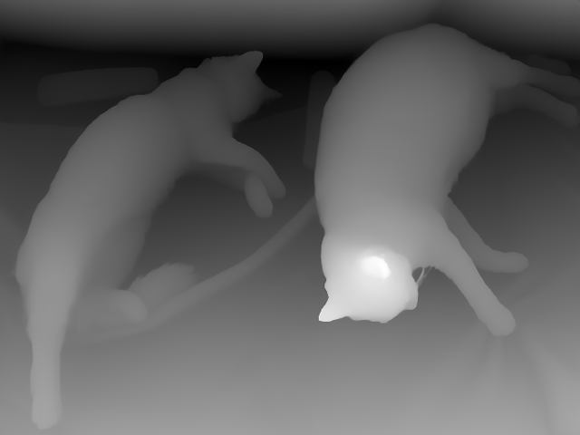

## Holiday Project Idea

Imagine having a robotic arm on your desk that can feed you a drink while you study.

Extra features:
- Cup that can heat or cool the liquid inside. A thermistor could be used to sense the temperature (not sure how well it would work).
- Use an arm that comes out of a backpack to grab and move the cup.
- The arm could also be placed on a desk to feed the drink to you while you study.

## Team Roles

- **Eric**: Making the arm and cup, and figuring out how they would move.

- **Hazik/Jim**: Vision system for the arm.

- **Isaac/Carter/Vrishank**: Making the PCB that can sense temperature. Making the PCB and connections for the arm.

### Vision Ideas

> Primarly vision in my opinion should be done in steps, Most of my ideas for this like a feedback back loop of constant information. For exmaple the ideal way for a proper arm would be to use Reinforcement Learning, would be the endgame goal perhaps. 

> My first step of idea is the use of depth estimation using image depth models, just to experiment around. 

> The second step would be object detection to see where the cup is. 

> Then use the information to make sure using some math ig to make it so that it can manouver to the point of the cup. 

> Picking it up is a whole different ball game. 

> The use of sensors like for acc or gyro should be super useful.

>> --- Hazik

## Vision Code

Majority of the models come from hugging face..

### Image Depth Analysis

Current Model experiment: 
>> https://huggingface.co/xingyang1/Distill-Any-Depth-Large-hf

#### Usage

1. Open terminal and navigate to the project root folder
2. Navigate to the vision folder: `cd vision`
3. Activate the virtual environment: `source ../.venv/bin/activate`
4. Install required packages: `pip install -r requirements.txt`
5. Run the depth estimation script: `python main.py`

The script downloads an image and creates a depth map showing how far objects are from the camera. Closer objects appear darker, distant objects appear lighter. This depth information helps the robotic arm understand the 3D layout of the scene to navigate around obstacles and locate the cup.

next step is perhaps seeing how to look at distances or using this info in a way.

#### Results

**Original Image:**

**Depth Map:**

